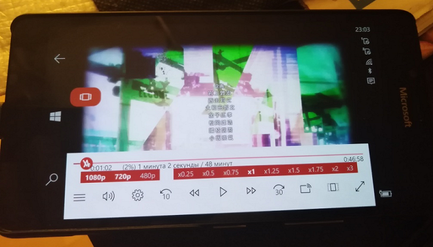
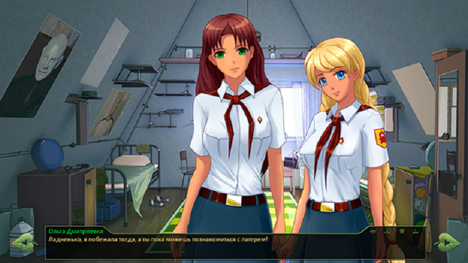

# AniLibria 2.4.8

## About
This is RnD thing... This is my client for Win10Mobile (min os build 15063).
I'm not designer... and the interface is a quite broken... but... it just works! =))))
Help to improve XAML if you can... and if you love JP anime also , too! 

## Screenshots

## Note
The great UWP project is lost... No more updates from the author....   
He decides to make QT/NET5(6)/WIN11/MAC/LINUX version of 
[Anilibria client](https://github.com/anilibria/anilibria-winmaclinux). 
So, W10M or old XBoxes needed to "recriation".

#References

https://github.com/anilibria  Project Anilibria

https://github.com/anilibria/anilibria-win  Anilibria app v1.0.18 (Windows)

https://github.com/anilibria/anilibria-app  Anilibria app v2.4.8 (Android)

AS-IS. Just for fun! 

-- me 2022

